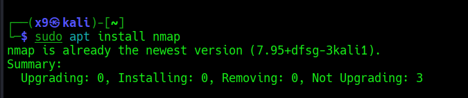
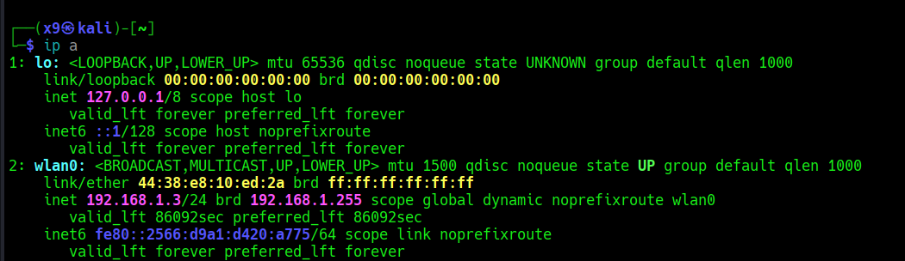
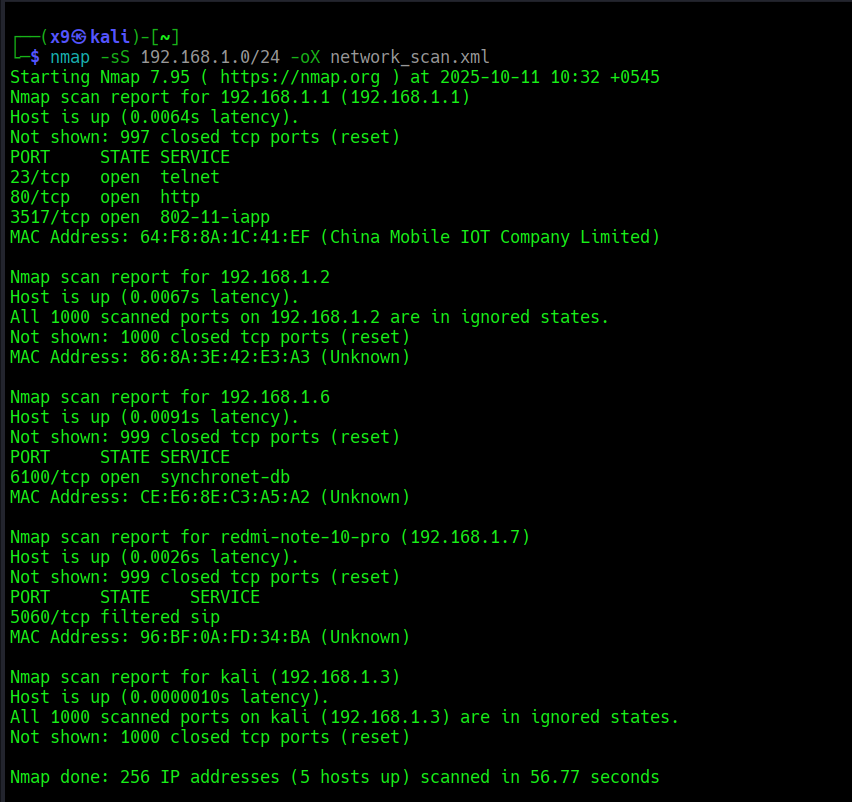
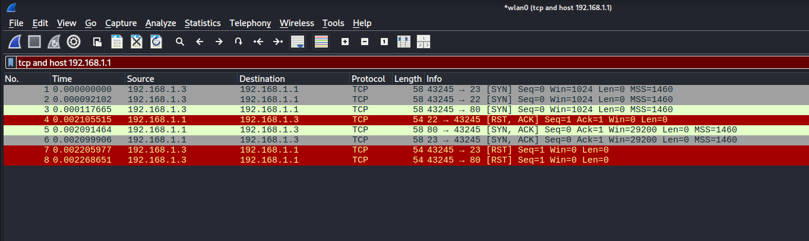
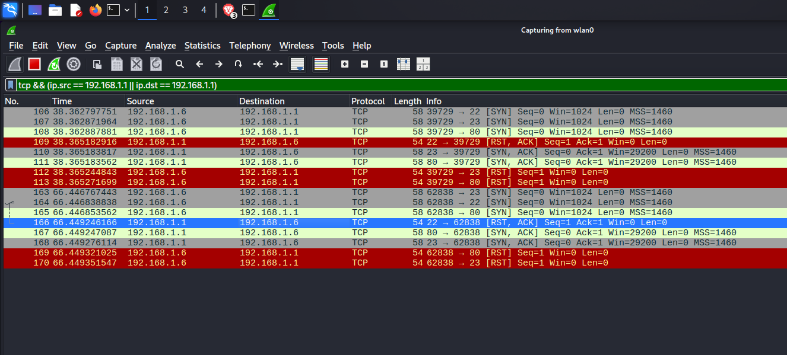

[Task 1: Scan Your Local Network for Open Ports](#task-1-scan-your-local-network-for-open-ports)

  - [Objective](#objective)
  - [Tools](#tools)
  - [Hints](#hints)
  - [Task Solution](#task-solution)
    - [finding Local ip range](#2-finding-local-ip-range)
    - [Performing TCP SYN scan using nmap](#3--performing-tcp-syn-scan-using-nmap)
    - [Analyzing packet capture with Wireshark](#4-analyzing-packet-capture-with-wireshark)

# Task 1: Scan Your Local Network for Open Ports

## Objective:
- Learn to discover open ports on devices in your local network to understand
network exposure

## Tools:
- ip
- Nmap
- wireshark

  ## Hints

1.Install Nmap from official website.

2.Find your local IP range (e.g., 192.168.1.0/24).

3.Run: nmap -sS 192.168.1.0/24 to perform TCP SYN scan.

4.Note down IP addresses and open ports found.

5.Optionally analyze packet capture with Wireshark.

6.Research common services running on those ports.

7.Identify potential security risks from open ports.

8.Save scan results as a text or HTML file.

## Task Solution
### 1. Installing Nmap 

- [Download Nmap](https://nmap.org/download.html) suitable for your system.
- Follow instruction provided by the website.
- In my case (kali linux) i used command `sudo apt install nmap`.
  
 

 ### 2. finding Local ip range 
 - command `ip a` is used to display the network interfaces and their associated IP addresses.

- my device ip: 192.168.1.3
- local IP range:192.168.1.0/24

### 3.  Performing TCP SYN scan using nmap
- command used :`nmap -sS 192.168.1.0/24 -oX network_scan.xml`
  
   here -oX is used to save the output file in xml formal. which can be used in other tools but in my case I have converted that xml into html file
  with the help of xsltproc tool
  
   [guide to comvert xml into html](https://nmap.org/book/output-formats-output-to-html.html),
  
  [other possible output formats in nmap](https://nmap.org/book/output.html)
 
  

  ### 4. IP addresses and open ports found

  🌐 [Nmap output in html](https://th3nobody.github.io/cybersecurity/task-1/assets/nmap-scan.html).

  🖥️ Target: 192.168.1.1

  |Port|State|Portocol|Service|
  |----|-----|--------|-------|
  |23|open|tcp|telnet|
  |80|open|tcp|http|
  |3517|open|tcp|802-11-iapp|

  #### Connected devices in the Network
  |IP|Device Type|Host name|
  |--|-----------|---------|
  |192.168.1.1|Router|192.168.1.1|
  |192.168.1.2|unknown|unknown|
  |192.168.1.3|kali machine|kali|
  |192.168.1.6|smart phone|redmi-note-10-pro|

  ### 5. Analyzing packet capture with Wireshark.

  - open `wireshark`
  - choose wlan0
  - nmap command: `nmap -sS 192.168.1.1`
    

    

       - here 192.168.1.1 is router ip and with filter `tcp && (ip.src == 192.168.1.1 || ip.dst == 192.168.1.1)` only communication with router under tcp protocal is captured in wire shark.

     

    ### 6. Common services running on those ports

    🌐 [common service](https://th3nobody.github.io/cybersecurity/task-1/assets/wireshark_nmap.html).

    |Port|Protocol|State|Reason|Service|Version|
    |----|--------|-----|------|-------|-------|
    |22|tcp|close|reset|ssh||
    |23|tcp|open|syn-ack|telnet||
    |80|tcp|open|syn-ack|http||

    ### 7. potential security risks from open ports
 
    
    |Port|Service|Risk level|Potential Risks|
    |----|-------|----------|---------------|
    |23|telnet|❗ High|• Unencrypted communication — credentials and data are sent in plaintext.  •  Legacy protocol lacking modern security features.  •  Provides remote access if misconfigured.| 
    |80|http|⚠ Medium|• Unencrypted web traffic vulnerable to MITM attacks.  • Possible exposure to common web vulnerabilities.   • Potential for phishing, malware hosting, or defacement if compromised |

  🌐 [Nmap output in html](https://th3nobody.github.io/cybersecurity/task-1/assets/nmap-scan.html).

  
  <h2 align="center">End</h2>

  ---
