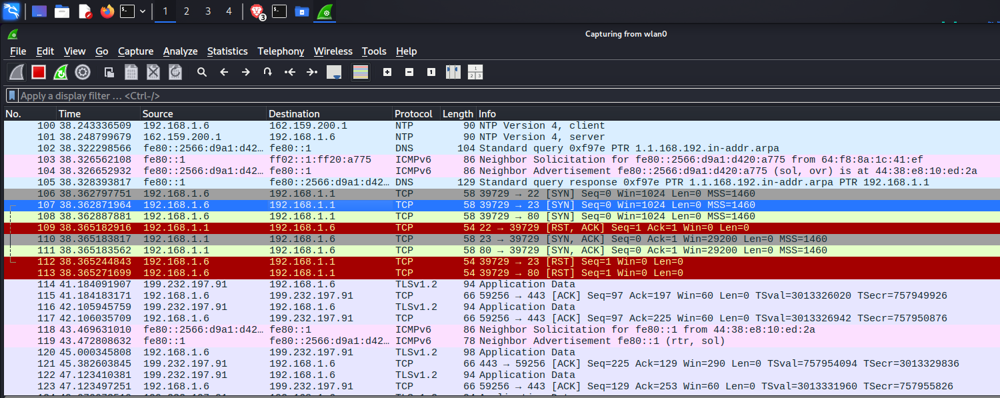

[Task 1: Scan Your Local Network for Open Ports](#task-1-scan-your-local-network-for-open-ports)

[Objective](https://github.com/th3nobody/cybersecurity/blob/main/task-1/report.md#objective)

# Task 1: Scan Your Local Network for Open Ports

## Objective:
- Learn to discover open ports on devices in your local network to understand
network exposure

## Tools:
- ip
- Nmap
- wireshark

## Task Solution
### 1. Installing Nmap [Download Nmap suitable for your system](https://nmap.org/download.html).
- In my case (kali linux) i used command `sudo apt install nmap`.
  
 

 ### 2. finding Local ip range 
 - command `ip a`

Result 
- my device ip: 192.168.1.3
- local IP range:192.168.1.0/24

### 3.  Performing TCP SYN scan using nmap
- command used :`nmap -sS 192.168.1.0/24 -oX network_scan.xml`
  
   here -oX is used to save the output file in xml formal. which can be used in other tools but in my case I have converted that xml into html file
  with the help of xsltproc tool
  
   [guide to comvert xml into html](https://nmap.org/book/output-formats-output-to-html.html),
  
  [other possible output formats in nmap](https://nmap.org/book/output.html)

  

  :link: [Nmap output in html](https://th3nobody.github.io/cybersecurity/task-1/assets/nmap-scan.html).

#### Open ports.

  |Port|State|Portocol|Service|
  |----|-----|--------|-------|
  |23|open|tcp|telnet|
  |80|open|tcp|http|
  |3517|open|tcp|802-11-iapp|

  #### Connected devices in the Network
  |IP|Device Type|Host name|
  |--|-----------|---------|
  |192.168.1.1|Router|192.168.1.1|
  |192.168.1.2|unknown|unknown|
  |192.168.1.3|kali machine|kali|
  |192.168.1.6|smart phone|redmi-note-10-pro|

  ### 4. Analyzing packet capture with Wireshark.

  - open `wireshark`
  - choose wlan0
  - nmap command: `nmap -sS -p 22,23,80 192.168.1.1`
     here 192.168.1.1 is router ip and with filter `tcp and host 192.168.1.1` only communication with router under tcp protoval is captured in wire shark.

    

  :link: [Nmap output in html](https://th3nobody.github.io/cybersecurity/task-1/assets/nmap-scan.html).

  
  <h2 align="center">End</h2>

  ---
