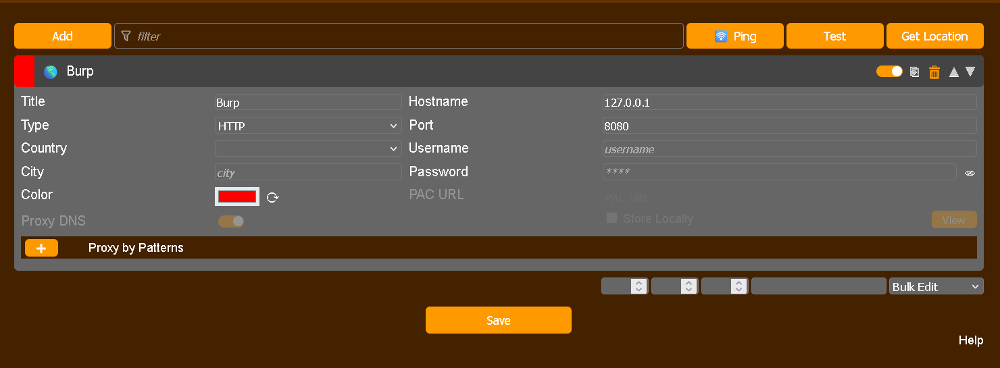
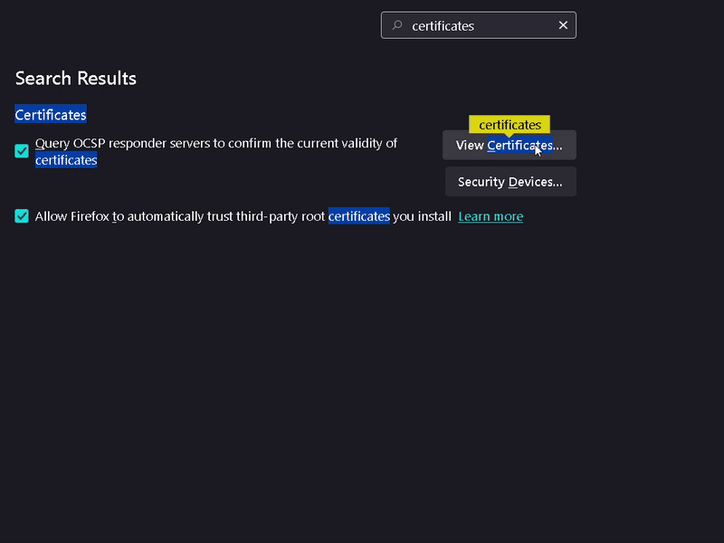
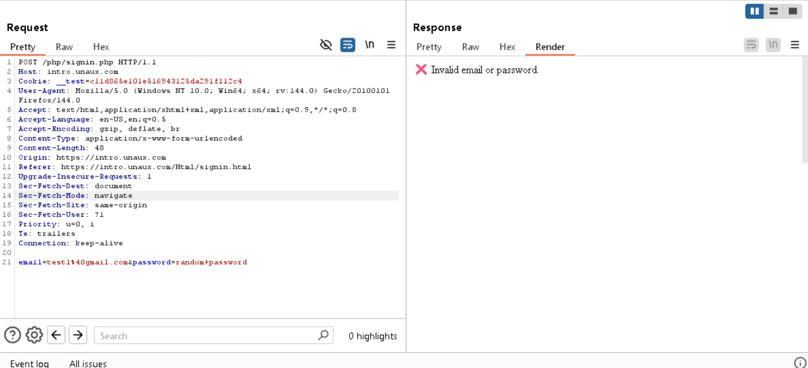

# Task 2: Web Application Analysis with Burp Suite

## Objective: 
- To learn the end-to-end process of identifying and analyzing a potential web vulnerability by intercepting  traffic, manually probing, running an automated attack, and comparing the results using Burp Suite's  integrated tools

  ## Tools:
- Burp Suite
- firefox browser
- foxy proxy (firefox extension)

  ## Hints

  1.Setup: Configure your browser to proxy through Burp Suite (127.0.0.1:8080) and install the CA certificate.

  2.Intercept: Use Proxy > Intercept to capture a login request from a practice website. Modify it and forward   to see the effect.

  3.Probe Manually: Find the request in Proxy > HTTP history, right-click, and "Send to Repeater". In Repeater,  modify parameters (like adding a ' to test for SQLi) and resend to analyze responses.

  4.Decode Data: If you see encoded text (like Base64) in Repeater, send it to the Decoder tab to view, modify,  and re-encode it for further testing.

  5.Set Up Attack: Right-click the request in Repeater and "Send to Intruder". In the Positions tab, clear default 
   selections (§) and mark only the password field as the payload position.

  6.Launch Attack: In the Payloads tab, load your password wordlist. Set the attack type to Sniper and click "Start 
   attack".
  
  7.Analyze Results: In the Intruder results window, sort by the "Length" column. A response with a different length 
    likely indicates a successful login.
  
  8.Compare to Confirm: Send one failed response and the suspected successful response to the Comparer tab.  Perform a
    "Words" comparison to visually confirm the differences and validate your findings.

  ## Task Solution

  ### 1. Setup:

- Install foxyproxy extension [for chromium web browser](https://chromewebstore.google.com/detail/foxyproxy/gcknhkkoolaabfmlnjonogaaifnjlfnp) and [for firefox](https://addons.mozilla.org/en-US/firefox/addon/foxyproxy-standard/?utm_source=addons.mozilla.org&utm_medium=referral&utm_content=search)
- Add 127.0.0.1 as hostname and 8080 as port in the foxyproxy extension
   
- go to [http://burp/](http://burp/) and download CA Certificate.
 
- Now burp is ready to capture requests.
 ### 2. Intercept:
- select burp from your foxyproxy extension.
- open target website enter login details.
- check in http history section, you will find all request made from your browser.
- send it to repeter and try modifing it and observe response from server.
 

### 3. Probe Manually

- Right click your login request and select send to Repeater.
- I tried adding 
