[Task 2: Web Application Analysis with Burp Suite](#task-2-web-application-analysis-with-burp-suite)
- [Objective](#objective)
- [Tools](#tools)
- [Hints](#hints)
- [Task Solution](#task-solution)
  - [1. Obtain a sample phishing email.](#1-obtain-a-sample-phishing-email)
     - [when sent to victim it looks like](#when-sent-to-victim-it-looks-like)
     - [comparing orignal email and phishing email template](#comparing-orignal-email-and-phishing-email-template)
  - [2. Examine sender's email address.](#2-examine-senders-email-address)
  - [3. Check email headers for discrepancies](#3-check-email-headers-for-discrepancies)
  - [4. Identify suspicious links or attachments.](#4-identify-suspicious-links-or-attachments)
     - [while visiting the link there was a instagram clone like website.](#while-visiting-the-link-there-was-a-instagram-clone-like-website)
  - [5. Looking for urgent or threatening language in the email body.](#5-looking-for-urgent-or-threatening-language-in-the-email-body)
  - [6. Note any mismatched URLs.](#6-note-any-mismatched-urls)
  - [7. Verify presence of spelling or grammar errors.](#7-verify-presence-of-spelling-or-grammar-errors)
  - [8. Summarize phishing traits found in the email.](#8-summarize-phishing-traits-found-in-the-email)
     - [Spoofed Sender Address](#spoofed-sender-address)
     - [Suspicious Links](#suspicious-links)
     - [Urgent and Threatening Language](#urgent-and-threatening-language)
     - [Result from gopish](#result-from-gopish)
     - [Leaked data from victim](#leaked-data-from-victim)
     - 
- [Outcome](#outcome)
- [⚠️ Disclaimer](#%EF%B8%8F-disclaimer)

# Task 3: Analyze a Phishing Email Sample

## Objective: 
-  Identify phishing characteristics in a suspicious email sample

  ## Tools:
- Email Client
- Header Analyzer.

## Hints

1.Obtain a sample phishing email (many free samples online).

2.Examine sender's email address for spoofing.

3.Check email headers for discrepancies (using online header analyzer).

4.Identify suspicious links or attachments.

5.Look for urgent or threatening language in the email body.

6.Note any mismatched URLs (hover to see real link).

7.Verify presence of spe ling or grammar errors.

8.Summarize phishing traits found in the email.

## Task Solution

---

### 1. Obtain a sample phishing email.
 

 🌐 [template](https://th3nobody.github.io/cybersecurity/task-3/assets/templats.html) 
 
  

 

### when sent to victim it looks like
  
    
  
  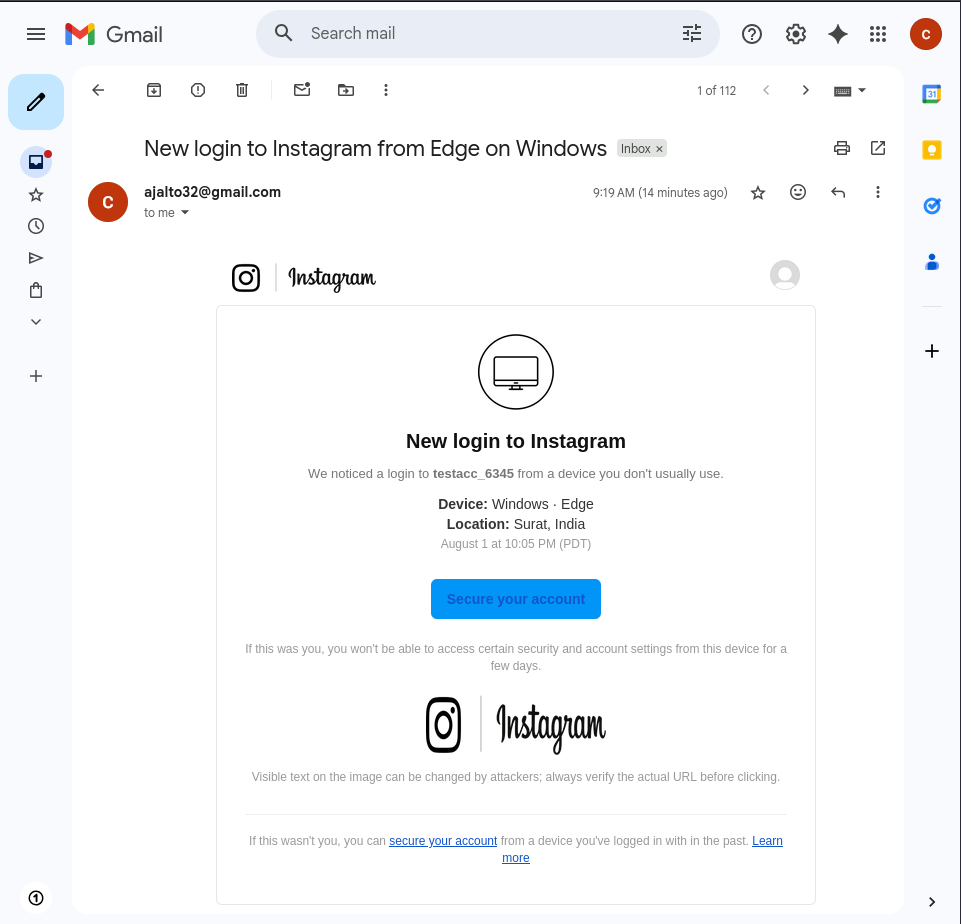 

  #### comparing orignal email and phishing email template

  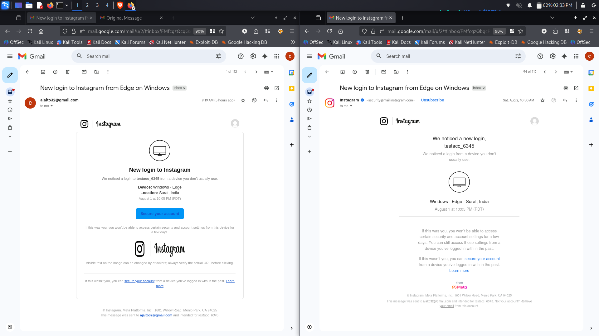 
  
  
  
   

  ---

### 2. Examine sender's email address.

- As seen in the image this mail was send by gophish using email `ajalto32@gmail.com`

   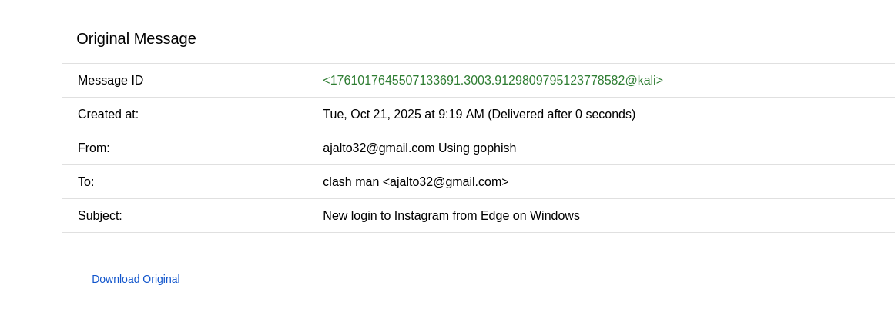
  
 

  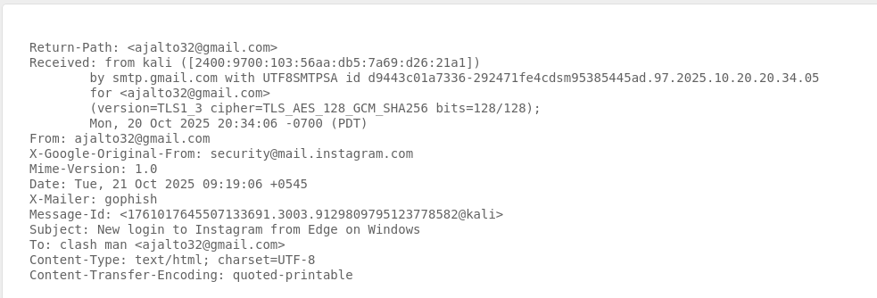

- Here in this mail X-Google-Original-From is set to  `security@mail.instagram.com`
  

      X-Google-Original-From: security@mail.instagram.com

   

- And X-Mailer is `gophish`

      X-Mailer: gophish
  

---

### 3. Check email headers for discrepancies

 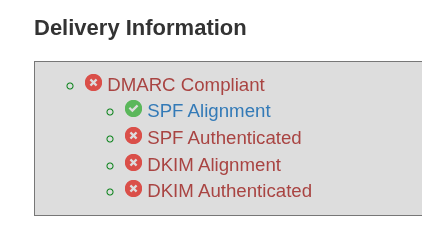

  

 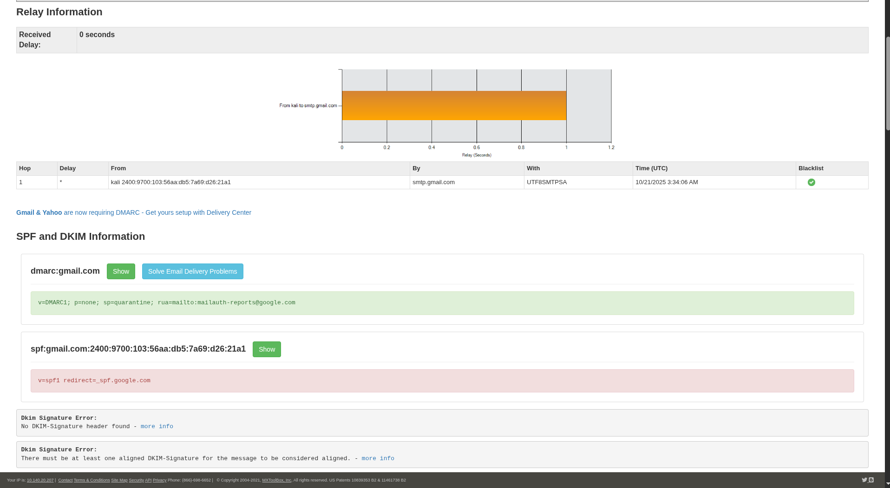

 

   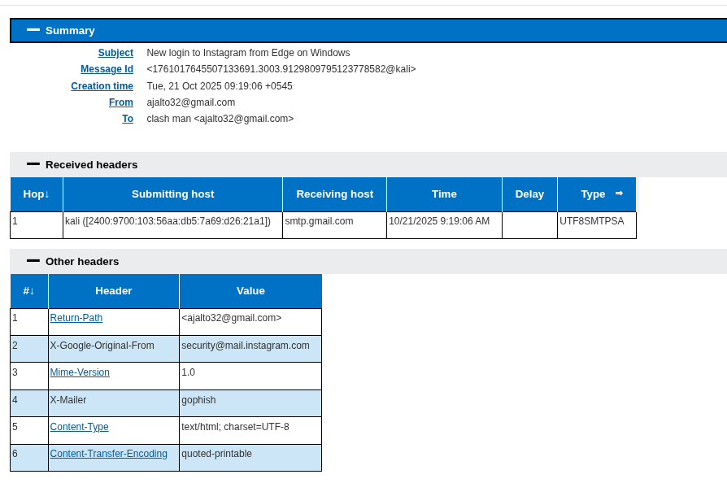

  

 ---

### 4. Identify suspicious links or attachments.

- On checking every clickable link I found that every link redirects to same site.

  
  
- link :

      https://largely-helpful-swift.global.ssl.fastly.net/NTQzYWNjMTAxMzkzM2MyYmM4MmE1YQ==/ig-en.php?profileid=780849966&amp;auth=OWZhMzQ1ZmExOGU3MGI4NzZjZGYzMA==

   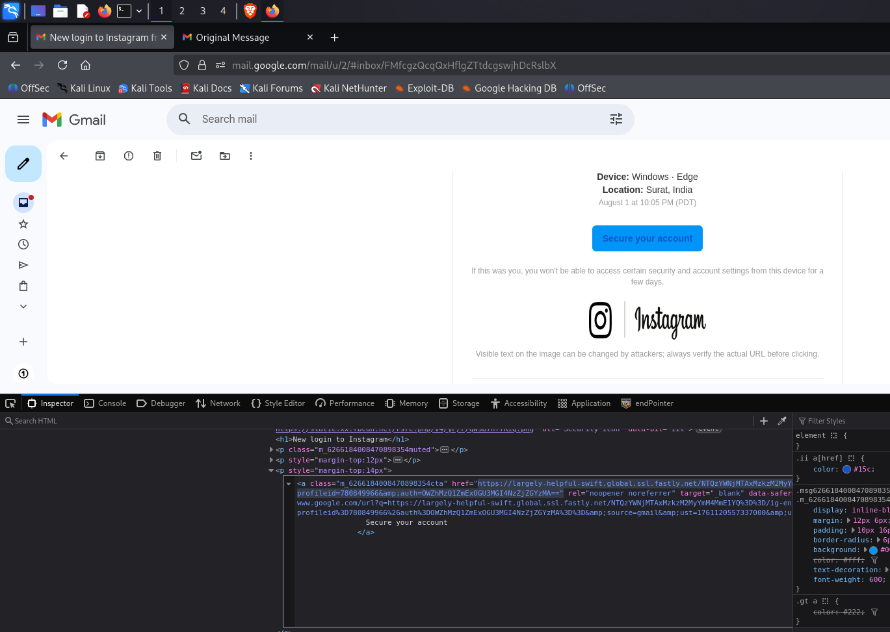

   

- #### while visiting the link there was a instagram clone like website.

   

 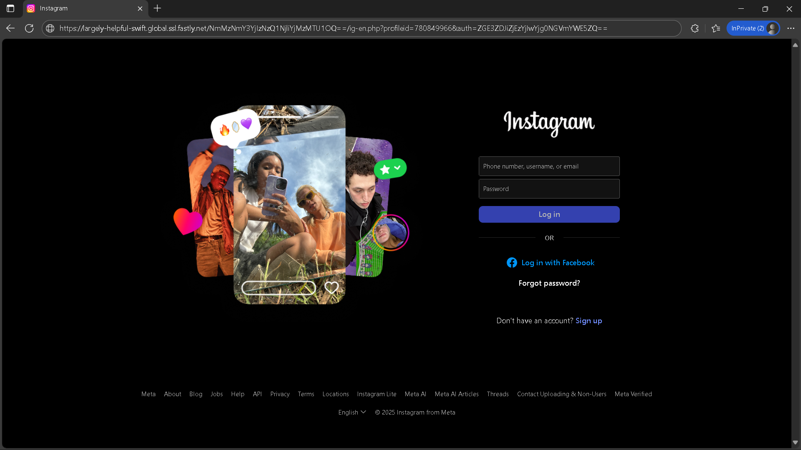  

  

 ---

 ### 5. Looking for urgent or threatening language in the email body.

 - The email is showing that my account was accessed outside of country and asked me to secure my account.
   

     

 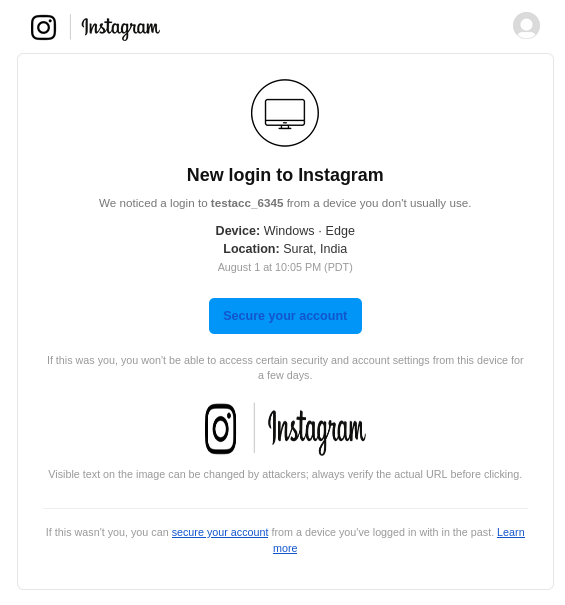  

   

 ---

 ### 6. Note any mismatched URLs.

- Checking all links , I came ti conclusion that whichever clickable link i click the outcome is came

- link :

      https://largely-helpful-swift.global.ssl.fastly.net/NTQzYWNjMTAxMzkzM2MyYmM4MmE1YQ==/ig-en.php?profileid=780849966&amp;auth=OWZhMzQ1ZmExOGU3MGI4NzZjZGYzMA==

   

  

   

---

### 7. Verify presence of spelling or grammar errors.

- Even though phishing email seems real there are some mojor mistakes in that template.
  - first mistake is sender email, nowadays official email are verified but this email is nither verified nor seems legitimate.
  - All new emails from meta comes with meta signature but this email does not contains one.
  

  

---

### 8. Summarize phishing traits found in the email.

- #### Spoofed Sender Address
   - The sender's email was supposed to be `security@mail.instagram.com` but the email came from email `ajalto32@gmail.com`.

- #### Suspicious Links
   - Even though the UI was almost same but the link was way too off

     i.e

          https://largely-helpful-swift.global.ssl.fastly.net/NTQzYWNjMTAxMzkzM2MyYmM4MmE1YQ==/ig-en.php?profileid=780849966&amp;auth=OWZhMzQ1ZmExOGU3MGI4NzZjZGYzMA==

 

 - #### Urgent and Threatening Language
    - The mail seems to give warning to user that their passsword has ben compromised and their account was loggedin by another person outside the country.
  
- #### Result from gopish

 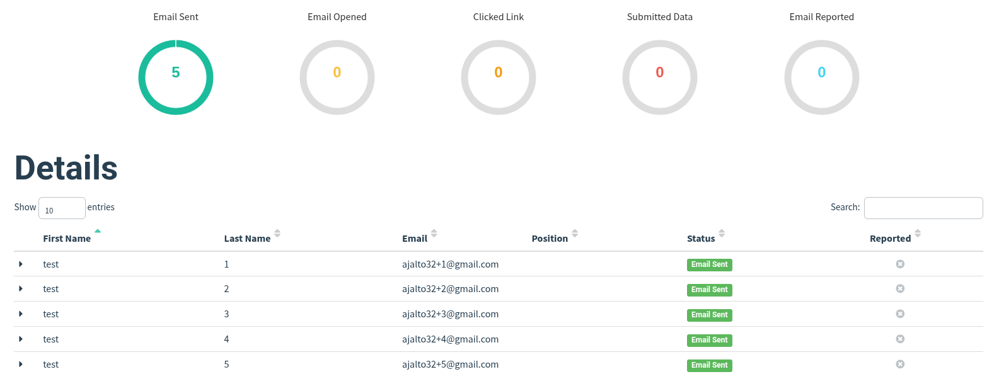

- #### Leaked data from victim

    - while the mail was send to 5 person 2 of then were Fooled to send their login credentials
 
       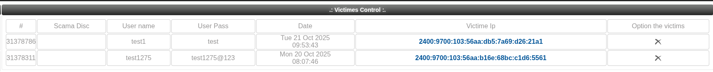

---

### Outcome: 
- Awareness of phishing tactics and email threat analysis skills.

 

---

 

## ⚠️ Disclaimer

#### All the test were performed under controlled envoronment , No real user is harmed during this testing purpose.

 

---
      
     

  

  
   
 

