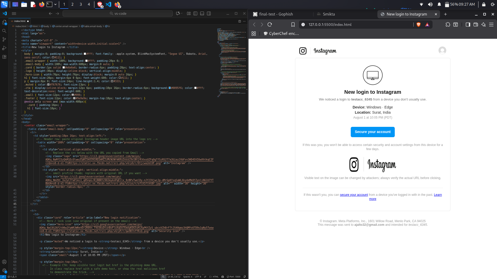

[Task 2: Web Application Analysis with Burp Suite](#task-2-web-application-analysis-with-burp-suite)
- [Objective](#objective)
- [Tools](#tools)
- [Hints](#hints)
- [Task Solution](#task-solution)

# Task 3: Analyze a Phishing Email Sample

## Objective: 
-  Identify phishing characteristics in a suspicious email sample

  ## Tools:
- Email Client
- Header Analyzer.

## Hints

1.Obtain a sample phishing email (many free samples online).

2.Examine sender's email address for spoofing.

3.Check email headers for discrepancies (using online header analyzer).

4.Identify suspicious links or attachments.

5.Look for urgent or threatening language in the email body.

6.Note any mismatched URLs (hover to see real link).

7.Verify presence of spe ling or grammar errors.

8.Summarize phishing traits found in the email.

## Task Solution

### 1. Obtain a sample phishing email.
 

 🌐 [template](https://th3nobody.github.io/cybersecurity/task-3/assets/templats.html) 
 
  

 

- when sent to victim it looks like
  
    
  
   

### 2. Examine sender's email address.
